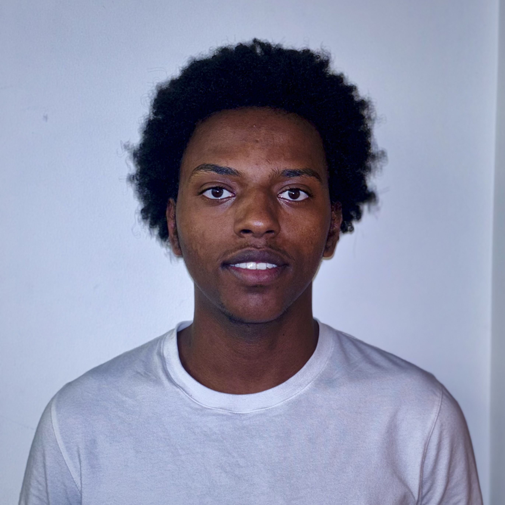

# Personal Portfolio Website

Single-page portfolio built with HTML and CSS.

## Project Files

- `index.html` - Page structure and all content.
- `style.css` - Visual theme, layout, responsive behavior, and animations.
- `profile.jpg` - Active profile picture.
- `profile-placeholder.svg` - Optional placeholder profile picture.
- `Gideon_Sife_Resume.pdf` - Resume linked on the page.

## Current Page Format

- Two-column desktop layout:
  - Left: sticky profile card (`.profile-panel`).
  - Right: content cards (`.hero`, `.about-card`, `.info-grid`).
- Mobile/tablet: stacked single-column layout via media queries.
- Typography:
  - Headings/UI: `Manrope`.
  - Body text: `Source Serif 4`.

## Text Format (`<p>` tags)

The `Certifications`, `Projects`, and `Interests` sections use paragraph formatting instead of list elements:

```html
<p class="detail-text">
  • Item one<br />
  • Item two
</p>
```

This is the active format in `index.html`.

## Run Locally

Open `index.html` in any browser.

## Edit Content

- Update profile details and social links in the left panel.
- Update bio paragraphs inside the `About` section.
- Update card text in `Certifications`, `Projects`, and `Interests` using `<p class="detail-text">`.
- Update resume link by editing the `href` for `View Resume`.

## Replace Profile Photo

Current image:

```html

```

To change it:

1. Add your new image file to this folder.
2. Update the `src` in `index.html`.
3. Use a roughly square image for best cropping in the circular frame.

## Last Update

- March 10, 2026: Redesigned layout and documented paragraph-based text formatting.
